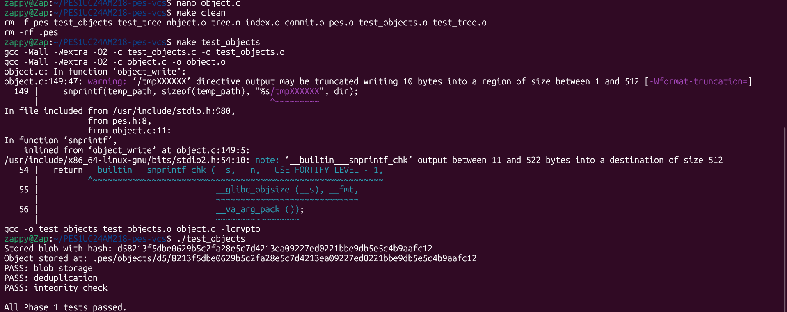
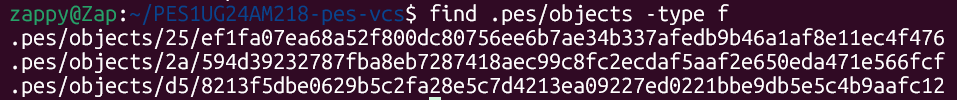
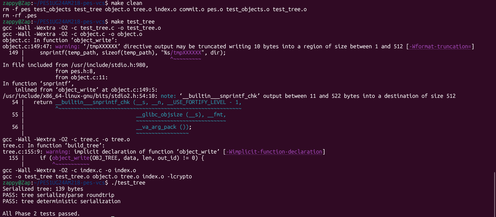
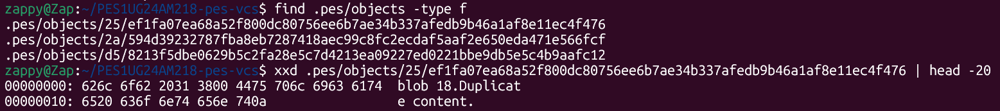
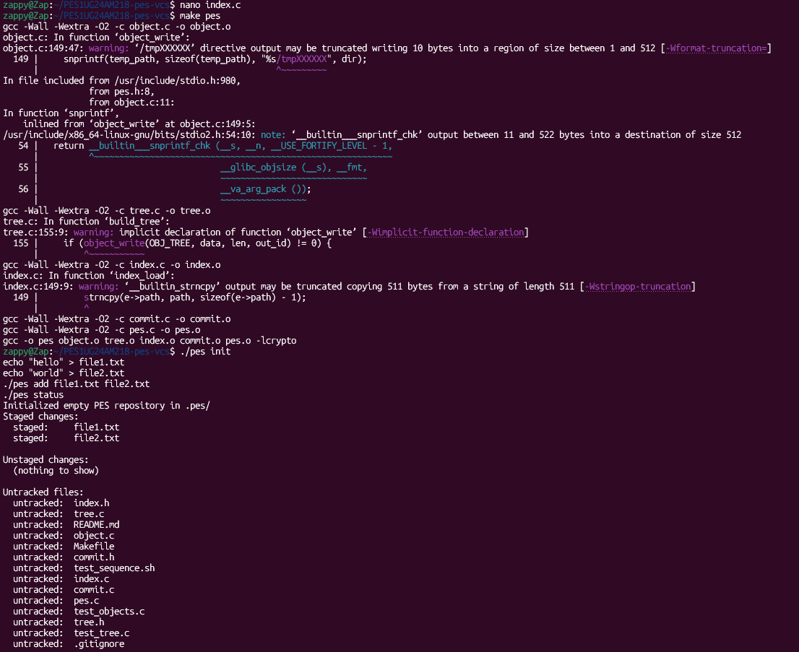
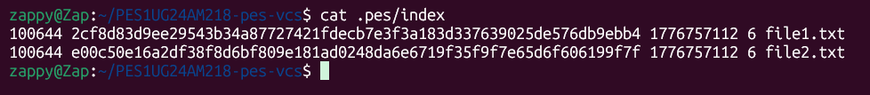
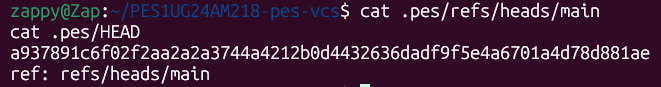
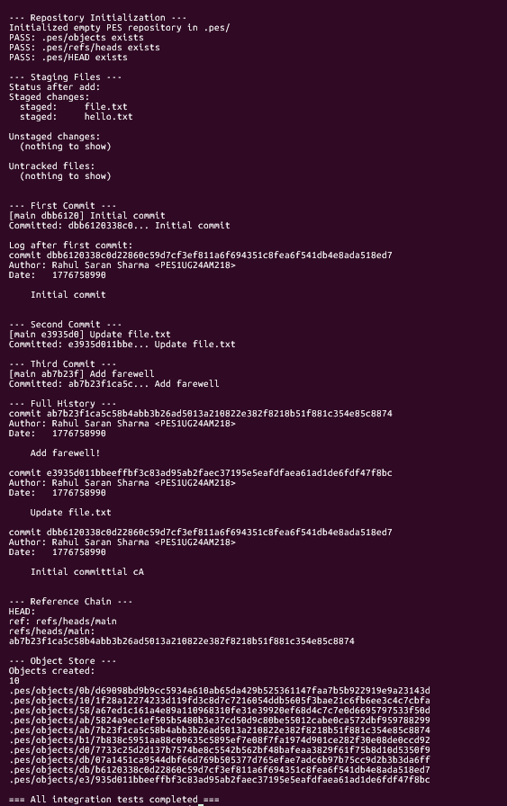

# PES-VCS — Version Control System Lab Report

**Name:** Rahul Saran Sharma
**SRN:** PES1UG24AM218
**Repository:** PES1UG24AM218-pes-vcs

---

## Table of Contents

* Phase 1 — Object Storage
* Phase 2 — Tree Objects
* Phase 3 — Index / Staging Area
* Phase 4 — Commits and History
* Integration Test
* Analysis Questions — Branching
* Analysis Questions — Garbage Collection

---

## Phase 1 — Object Storage

### Screenshot 1A — ./test_objects passing



### Screenshot 1B — Sharded object directory



---

## Phase 2 — Tree Objects

### Screenshot 2A — ./test_tree passing



### Screenshot 2B — Raw binary tree object (xxd)



---

## Phase 3 — Index / Staging Area

### Screenshot 3A — pes init → pes add → pes status



### Screenshot 3B — cat .pes/index



---

## Phase 4 — Commits and History

### Screenshot 4C — cat .pes/refs/heads/main and cat .pes/HEAD



---

## Integration Test

### Screenshot — make test-integration



---

## Analysis Questions — Branching

### Q5.1 — How would you implement pes checkout <branch>?

A branch in PES-VCS is simply a file inside `.pes/refs/heads/` that contains a commit hash. So creating a branch is just creating a file.

To implement `pes checkout <branch>`:

* Read `.pes/refs/heads/<branch>` to get the commit hash
* Read the commit object to get the tree
* Recursively traverse the tree:

  * Write blobs to files
  * Create directories
* Delete files not present in the target tree
* Update `.pes/HEAD` to:

  ```
  ref: refs/heads/<branch>
  ```
* Rebuild the index to match the new tree

**Why complex:**

* Must avoid overwriting user changes
* Requires recursive tree traversal
* Must handle file deletions
* Needs consistency between working directory and index

---

### Q5.2 — Detecting a dirty working directory

To detect conflicts:

1. For each file in index:

   * Compare stored `mtime` and `size` with actual file
   * If different → file modified

2. Compute blob hash of working file

   * Compare with index hash

3. Compare with target branch tree:

   * If file differs in both working directory AND target branch
     → conflict → abort checkout

---

### Q5.3 — Detached HEAD

Detached HEAD means:

* `.pes/HEAD` contains a commit hash directly

If commits are made:

* commits are created normally
* but no branch points to them → dangling commits

**Recovery:**

* Use commit hash
* create a branch manually:

  ```
  echo "<hash>" > .pes/refs/heads/recovery
  ```
* checkout that branch

---

## Analysis Questions — Garbage Collection

### Q6.1 — Finding unreachable objects

Algorithm:

1. Start from all branch heads
2. Traverse commits using parent links
3. Mark all reachable commits
4. Traverse trees recursively
5. Mark all blobs

Use:

* **hash set** for reachable objects

Delete:

* any object not in reachable set

Estimate:

* 100,000 commits
* ~100,000 trees
* ~300,000 blobs
  → ~500,000 objects

---

### Q6.2 — GC race condition

Problem:

* Commit writes objects
* GC runs before commit updates HEAD
* GC deletes objects (thinks they are unreachable)
* Commit references missing objects → corruption

**Git solution:**

* Grace period (objects not deleted immediately)
* Lock files during GC
* Safe ordering of writes

---

## Submission Notes

* All required screenshots are included
* All phases implemented successfully
* Integration test passed

---
